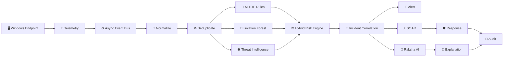
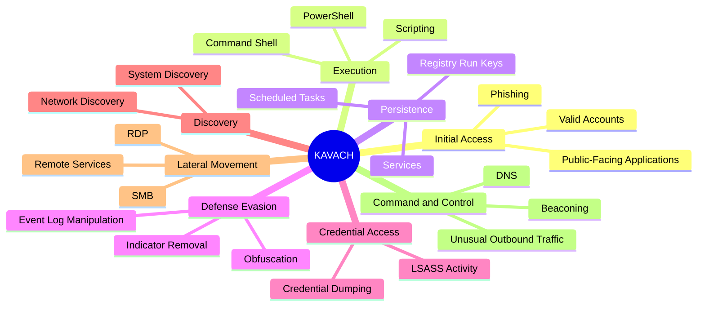
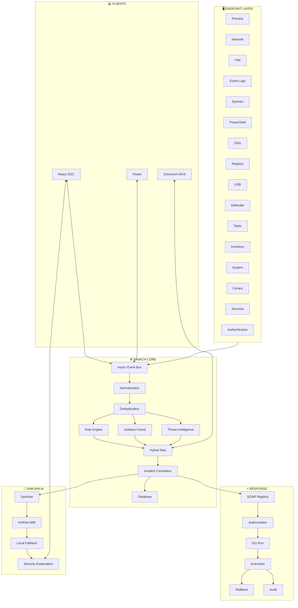

<div align="center">

# 🛡️ KAVACH

### `AI-DRIVEN SOAR • XDR • THREAT INTELLIGENCE • RESPONSE`


<br>


<br><br>

<a href="#-kavach">

</a>
<a href="#-architecture">

</a>
<a href="#-quick-start">

</a>

<br><br>


</div>

---

<div align="center">

## ⚡ KAVACH SECURITY CORE

```text
                         ╔══════════════════════════════╗
                         ║        🛡️  K A V A C H       ║
                         ║     SECURITY INTELLIGENCE    ║
                         ╚══════════════════════════════╝
                                      │
              ┌───────────────────────┼───────────────────────┐
              │                       │                       │
              ▼                       ▼                       ▼
       ┌──────────────┐       ┌──────────────┐       ┌──────────────┐
       │   DETECT     │       │  UNDERSTAND  │       │   RESPOND    │
       │              │       │              │       │              │
       │  Rules + ML  │──────▶│  Raksha AI   │──────▶│    SOAR      │
       │  MITRE + TI  │       │  Correlation │       │  Automation  │
       └──────────────┘       └──────────────┘       └──────────────┘
              ▲                       ▲                       │
              │                       │                       ▼
       ┌──────┴───────┐       ┌───────┴──────┐        ┌──────────────┐
       │   TELEMETRY  │       │   INCIDENT   │        │    AUDIT     │
       │   16 ENGINES │       │    ENGINE    │        │   + ROLLBACK │
       └──────────────┘       └───────────────┘        └──────────────┘
```

### `SENSE → DETECT → CORRELATE → EXPLAIN → RESPOND → PROTECT`

</div>

---

# 🛡️ KAVACH

**KAVACH** — कवच (*shield / armor*) — is a unified **AI-driven SOAR-XDR cybersecurity platform** designed to continuously observe endpoint behavior, detect suspicious activity, correlate evidence, enrich threats with intelligence, explain incidents, and execute controlled response actions.

It combines:

> **XDR + SOAR + Behavioral ML + MITRE ATT&CK + Threat Intelligence + URL Security + Raksha AI**

into one security operations ecosystem.

---

# 🌌 THE KAVACH VISION

<div align="center">

```text
                         THE DIGITAL ENVIRONMENT
                                  │
                                  ▼
                    ┌─────────────────────────┐
                    │       KAVACH            │
                    │   CONTINUOUS DEFENSE    │
                    └────────────┬────────────┘
                                 │
        ┌────────────────────────┼────────────────────────┐
        │                        │                        │
        ▼                        ▼                        ▼
   🖥️ ENDPOINTS             🌐 NETWORK               🌍 WEB
        │                        │                        │
        └────────────────────────┼────────────────────────┘
                                 ▼
                       ┌─────────────────┐
                       │  INTELLIGENCE   │
                       ├─────────────────┤
                       │ MITRE ATT&CK    │
                       │ IsolationForest │
                       │ Threat Intel    │
                       │ Correlation     │
                       └────────┬────────┘
                                ▼
                         ┌──────────────┐
                         │  RAKSHA AI   │
                         │              │
                         │  Understand  │
                         │  Explain     │
                         │  Recommend   │
                         └──────┬───────┘
                                ▼
                         ┌──────────────┐
                         │    SOAR      │
                         │   RESPONSE   │
                         └──────┬───────┘
                                ▼
                           🛡️ PROTECTED
```

</div>

---

# 🔥 PLATFORM CAPABILITIES

<table>
<tr>
<td width="50%">

### 🖥️ XDR

Continuous endpoint visibility across:

* Processes
* Network connections
* Files
* Registry
* Services
* PowerShell
* Sysmon
* Windows Event Logs
* DNS
* USB devices

</td>

<td width="50%">

### ⚡ SOAR

Controlled automated response:

* Device isolation
* Domain blocking
* Process termination
* Evidence collection
* Ransomware containment
* Credential-dumping containment
* Brute-force defense

</td>
</tr>

<tr>
<td>

### 🧠 BEHAVIORAL ML

Real `IsolationForest` anomaly detection.

No fabricated predictions.

No artificial confidence.

Insufficient data → `insufficient_data`

</td>

<td>

### 🤖 RAKSHA AI

AI cybersecurity copilot with:

* NVIDIA NIM
* Local fallback
* Context sanitization
* Incident explanation
* Defensive recommendations

</td>
</tr>

<tr>
<td>

### 🎯 MITRE ATT&CK

Behavior mapped to:

* Tactics
* Techniques
* Detection coverage
* Incident context
* SOC heatmaps

</td>

<td>

### 🌐 URL SHIELD

Protection against:

* Phishing
* Homographs
* Punycode
* Typosquatting
* SSRF
* Metadata endpoint access

</td>
</tr>
</table>

---

# 🧬 KAVACH INTELLIGENCE FABRIC



---

# 🛰️ 16-ENGINE ENDPOINT TELEMETRY

<div align="center">

|      | Engine                | Detection Domain                            |
| :--: | --------------------- | ------------------------------------------- |
| `01` | 🧠 Process Collector  | LOLBins, PowerShell, parent-child anomalies |
| `02` | 🌐 Network Collector  | C2, scanning, unusual connections           |
| `03` | 📁 File Integrity     | Ransomware-like activity                    |
| `04` | 🔐 Login / Auth       | Brute force, RDP anomalies                  |
| `05` | 💻 PowerShell         | Obfuscation, suspicious scripts             |
| `06` | 🔬 Sysmon             | High-fidelity Windows telemetry             |
| `07` | 📜 Windows EventLog   | Services, audit manipulation                |
| `08` | 🌍 DNS                | DGA-like behavior, tunneling                |
| `09` | 🗂️ Registry          | Persistence                                 |
| `10` | 🔌 USB                | Rogue device activity                       |
| `11` | 🛡️ Windows Defender  | Threat/quarantine telemetry                 |
| `12` | ⏰ Scheduled Tasks     | Persistence                                 |
| `13` | 📦 Software Inventory | Vulnerable software                         |
| `14` | 📊 System Telemetry   | Host baseline                               |
| `15` | 🐤 Canary             | Early ransomware warning                    |
| `16` | ⚙️ Service Collector  | Service persistence                         |

</div>

---

# 🧠 BEHAVIORAL ML ENGINE

### Genuine machine learning. Zero fake predictions.

```python
from sklearn.ensemble import IsolationForest
```

KAVACH extracts behavioral characteristics from endpoint telemetry.

```text
┌─────────────────────────────────────────────┐
│           BEHAVIORAL FEATURE VECTOR         │
├─────────────────────────────────────────────┤
│ Process rarity                              │
│ Destination-port diversity                  │
│ Network burst ratio                         │
│ Parent-child deviation                      │
│ Command-line entropy                        │
│ Process frequency                            │
│ Connection irregularity                      │
│ Host activity deviation                      │
│ File modification behavior                   │
│ Execution-pattern deviation                  │
└─────────────────────────────────────────────┘
```

### Strict model readiness

```text
                 MODEL STATE
                     │
          ┌──────────┴──────────┐
          │                     │
          ▼                     ▼
      SUFFICIENT            INSUFFICIENT
        DATA                    DATA
          │                     │
          ▼                     ▼
   Isolation Forest        No prediction
          │                     │
          ▼                     ▼
    Anomaly Signal        insufficient_data
```

KAVACH never turns missing training data into an invented security score.

---

# 🎯 MITRE ATT&CK DETECTION FABRIC



---

# 🌐 KAVACH URL SHIELD

```text
                    URL REQUEST
                         │
                         ▼
               ┌───────────────────┐
               │ URL NORMALIZATION │
               └─────────┬─────────┘
                         ▼
               ┌───────────────────┐
               │ LEXICAL ANALYSIS  │
               └─────────┬─────────┘
                         ▼
              ┌──────────────────────┐
              │ IDN / HOMOGRAPH CHECK│
              └──────────┬───────────┘
                         ▼
              ┌──────────────────────┐
              │ TYPOSQUAT ANALYSIS   │
              └──────────┬───────────┘
                         ▼
              ┌──────────────────────┐
              │ SSRF POLICY ENGINE   │
              └──────────┬───────────┘
                         ▼
                 ┌───────┴───────┐
                 ▼               ▼
               SAFE            BLOCK
                 │               │
                 ▼               ▼
                OK          SECURITY ALERT
```

### SSRF protection

```text
127.0.0.0/8
10.0.0.0/8
172.16.0.0/12
192.168.0.0/16
169.254.169.254
::1
```

are treated as restricted destinations where applicable to the URL security policy.

---

# 🧩 BROWSER SHIELD

<div align="center">

```text
       🌐 BROWSER
           │
           ▼
   ┌──────────────────┐
   │ KAVACH EXTENSION │
   │    MV3 SHIELD    │
   └────────┬─────────┘
            │
       ┌────┴────┐
       ▼         ▼
    ANALYZE    ANALYZE
       │         │
       └────┬────┘
            ▼
      ┌───────────┐
      │   RISK    │
      │  ENGINE   │
      └─────┬─────┘
            │
     ┌──────┼──────┐
     ▼      ▼      ▼
    🟢     🟡     🔴
    OK    WARN    RISK
```

</div>

The Chromium Manifest V3 extension provides lightweight real-time browser protection with minimal permissions.

---

# 🤖 RAKSHA AI

<div align="center">


</div>

Raksha AI is KAVACH's embedded cybersecurity assistant.

### Intelligence hierarchy

```text
                 SECURITY EVIDENCE
                        │
                        ▼
             ┌────────────────────┐
             │ KAVACH CORE ENGINE  │
             └─────────┬──────────┘
                       │
          ┌────────────┼────────────┐
          ▼            ▼            ▼
       MITRE           ML           TI
          │            │            │
          └────────────┼────────────┘
                       ▼
               INCIDENT CONTEXT
                       │
                       ▼
              CONTEXT SANITIZER
                       │
                       ▼
                  RAKSHA AI
                       │
              ┌────────┴────────┐
              ▼                 ▼
         NVIDIA NIM        LOCAL FALLBACK
              │                 │
              └────────┬────────┘
                       ▼
                 EXPLANATION
```

### AI failure does not equal security failure.

```text
NVIDIA NIM unavailable
          ↓
Local provider
          ↓
Heuristic fallback
          ↓
KAVACH continues operating
```

---

# 🔐 CONTEXT SANITIZATION

Before external AI processing, sensitive context is sanitized.

```text
🔑 API KEYS
🔒 PASSWORDS
🎫 BEARER TOKENS
👤 PII
🪪 AUTHENTICATION SECRETS
```

The AI layer is intentionally treated as an **advisory intelligence component**, not the authoritative detection source.

---

# ⚡ SOAR RESPONSE ENGINE

<div align="center">

```text
                 🚨 SECURITY INCIDENT
                          │
                          ▼
                ┌──────────────────┐
                │ INCIDENT ENGINE  │
                └────────┬─────────┘
                         ▼
                 ┌───────────────┐
                 │ AUTHORIZATION │
                 └───────┬───────┘
                         ▼
                 ┌───────────────┐
                 │    PLAYBOOK   │
                 └───────┬───────┘
                         ▼
                 ┌───────────────┐
                 │     DRY RUN   │
                 └───────┬───────┘
                         ▼
                  HUMAN APPROVAL
                         │
                         ▼
                 ⚡ EXECUTION
                         │
                         ▼
                  📜 AUDIT LOG
                         │
                         ▼
                   ↩️ ROLLBACK
```

</div>

### Response playbooks

| Playbook               | Actions                                                           |
| ---------------------- | ----------------------------------------------------------------- |
| 🦠 Ransomware          | Process containment → file quarantine → network isolation → alert |
| 🔑 Credential Dumping  | Process containment → session response → token invalidation       |
| 🔨 Brute Force         | Detection → source blocking → alert                               |
| 🌐 Malicious Domain    | Domain analysis → policy action → audit                           |
| 🔬 Evidence Collection | Gather relevant forensic evidence                                 |

Every high-impact response path is designed around **authorization, dry-run capability, auditability, and rollback**.

---

# 🖥️ SOC EXPERIENCE

## 👤 Normal User Mode

```text
╔══════════════════════════════════════╗
║                                      ║
║             🛡️ KAVACH                ║
║                                      ║
║              94 / 100                ║
║                                      ║
║        🟢 YOU ARE PROTECTED          ║
║                                      ║
║     Everything looks normal.         ║
║                                      ║
╚══════════════════════════════════════╝
```

Simple.

Calm.

Understandable.

---

## 🧑‍💻 Analyst Mode

```text
┌──────────────────────────────────────────────────────┐
│ INCIDENT #KVC-1042                     🔴 CRITICAL   │
├──────────────────────────────────────────────────────┤
│ Host          DESKTOP-01                             │
│ PID           4832                                    │
│ Parent PID    920                                     │
│ Technique     PowerShell                              │
│ Tactic        Execution                               │
│ IOC           Correlated                              │
│ ML State      READY                                   │
│ Risk          91 / 100                                │
│ Correlation   CLUSTER-17                              │
├──────────────────────────────────────────────────────┤
│ RAKSHA AI                                               │
│ "Multiple behavioral indicators support escalation." │
└──────────────────────────────────────────────────────┘
```

---

# 🌌 SOC VISUALIZATION

KAVACH's web SOC is designed around a modern security-operations aesthetic:

* 🌌 Glassmorphic interface
* 🛡️ Interactive 3D cyber shield
* 📡 Real-time WebSocket telemetry
* 📊 Chart.js analytics
* ⚡ Threat severity visualization
* 🌓 Dark / Light themes
* 📱 Responsive layouts
* 🧠 Embedded AI assistance

---

# 📱 CROSS-PLATFORM SECURITY

```text
                       KAVACH CORE
                            │
          ┌─────────────────┼─────────────────┐
          │                 │                 │
          ▼                 ▼                 ▼
      🌐 WEB SOC        🧩 BROWSER        📱 MOBILE
          │              SHIELD              │
          │                                   │
          └─────────────────┬─────────────────┘
                            ▼
                       FASTAPI API
                            │
                       🛡️ SECURITY
```

Flutter client targets:

```text
Android
iOS
Windows
macOS
Linux
Web
```

---

# 🏗️ COMPLETE ARCHITECTURE



---

# 🧰 TECHNOLOGY STACK

<div align="center">

### Backend


### Frontend


### Mobile


### AI / Security


<br><br>


</div>

---

# 📁 REPOSITORY

```text
KAVACH/
│
├── 🛡️ backend/
│   ├── ai/
│   ├── api/
│   ├── auth/
│   ├── collectors/
│   ├── core/
│   ├── database/
│   ├── email_notifications/
│   ├── mitre/
│   ├── ml/
│   ├── pipeline/
│   ├── playbooks/
│   ├── reports/
│   ├── response/
│   ├── static/
│   ├── tests/
│   ├── threatintel/
│   ├── main.py
│   ├── requirements.txt
│   └── tui.py
│
├── 🌐 frontend/
│   ├── src/
│   └── package.json
│
├── 📱 mobile/
│   ├── lib/
│   ├── android/
│   ├── ios/
│   ├── linux/
│   ├── macos/
│   ├── windows/
│   ├── web/
│   └── pubspec.yaml
│
├── 🧩 extension/
│
├── 📚 Documents/
│
├── ⚙️ start_all_servers.bat
├── ⚙️ start_all_servers.ps1
├── 🚫 .gitignore
└── 📖 README.md
```

---

# 🚀 QUICK START

## 01 — Clone

```bash
git clone <YOUR_REPOSITORY_URL>
cd KAVACH
```

## 02 — Backend

```bash
cd backend
python -m venv venv
```

### Windows

```powershell
venv\Scripts\activate
```

### Install

```bash
pip install -r requirements.txt
```

---

# ⚙️ ENVIRONMENT

```powershell
copy .env.example .env
```

Example:

```env
JWT_SECRET=your-secure-secret

GEMINI_API_KEY=
NVIDIA_API_KEY=

SMTP_HOST=
SMTP_PORT=
SMTP_USERNAME=
SMTP_PASSWORD=
```

> 🔐 Never commit real credentials, API keys, tokens, or passwords.

---

# ▶️ RUN KAVACH

### Full XDR Mode

```bash
python main.py
```

### Lightweight Development Mode

```bash
python main.py --no-collectors
```

---

# 🌐 SERVICES

| Service      | Location               |
| ------------ | ---------------------- |
| 🛡️ Backend  | `localhost:8000`       |
| 📚 Swagger   | `localhost:8000/docs`  |
| 📖 ReDoc     | `localhost:8000/redoc` |
| 🌐 React SOC | `localhost:5173`       |
| 🖥️ TUI      | `python tui.py`        |

---

# 🌐 FRONTEND

```bash
cd frontend
npm install
npm run dev
```

---

# 📱 MOBILE

```bash
cd mobile
flutter pub get
flutter run
```

---

# 🔌 API SURFACE

```text
AUTH
├── POST /api/v1/auth/register
├── POST /api/v1/auth/login
└── POST /api/v1/auth/verify-otp

DASHBOARD
├── GET /api/v1/dashboard/summary
└── WS  /api/v1/dashboard/live

ALERTS
├── GET  /api/v1/alerts
└── POST /api/v1/alerts/{id}/explain

INCIDENTS
└── GET /api/v1/incidents

THREAT INTELLIGENCE
└── POST /api/v1/threats/analyze-url

MITRE
├── GET /api/v1/mitre/techniques
└── GET /api/v1/mitre/heatmap

SOAR
└── POST /api/v1/playbooks/execute

RAKSHA AI
└── POST /api/v1/chatbot/soc

REPORTING
└── GET /api/v1/reports/soc

SYSTEM
└── GET /api/v1/system/health
```

---

# 🔐 SECURITY MODEL

```text
                    REQUEST
                       │
                       ▼
                ┌─────────────┐
                │    AUTH     │
                └──────┬──────┘
                       ▼
                ┌─────────────┐
                │    RBAC     │
                └──────┬──────┘
                       ▼
                ┌─────────────┐
                │ VALIDATION  │
                └──────┬──────┘
                       ▼
                ┌─────────────┐
                │   ENGINE    │
                └──────┬──────┘
                       ▼
             ┌─────────┴─────────┐
             ▼                   ▼
          ANALYSIS             ACTION
             │                   │
             ▼                   ▼
        RISK ENGINE          SOAR GUARD
             │                   │
             └─────────┬─────────┘
                       ▼
                   AUDIT LOG
```

---

# 👥 RBAC

| Capability             | 🛡️ SOC Analyst | 👤 Normal User |
| ---------------------- | :-------------: | :------------: |
| Security Score         |        ✅        |        ✅       |
| Personal Alerts        |        ✅        |        ✅       |
| Security Tips          |        ✅        |        ✅       |
| Raksha AI              |        ✅        |        ✅       |
| Live Telemetry         |        ✅        |        ❌       |
| MITRE Matrix           |        ✅        |        ❌       |
| Threat Hunting         |        ✅        |        ❌       |
| Incident Investigation |        ✅        |        ❌       |
| Collector Management   |        ✅        |        ❌       |
| SOAR                   |        ✅        |        ❌       |
| Device Isolation       |        ✅        |        ❌       |
| Quarantine             |        ✅        |        ❌       |
| Evidence Collection    |        ✅        |        ❌       |

---

# 🧪 TESTING

```bash
pytest
```

Coverage areas include:

```text
Authentication
API Security
Telemetry
ML
MITRE Detection
Threat Intelligence
Incident Correlation
SOAR
Security Controls
```

---

# 💡 DESIGN PRINCIPLES

<div align="center">

| Principle               | Meaning                                             |
| ----------------------- | --------------------------------------------------- |
| 🧠 **Evidence First**   | Decisions originate from observable evidence        |
| 🤖 **AI Assists**       | AI explains; it does not become the source of truth |
| 🚫 **No Fake ML**       | Insufficient data means no fabricated prediction    |
| 🛡️ **Fail Safe**       | AI/service failure does not disable core security   |
| 🔐 **Least Privilege**  | Access is limited by role and capability            |
| 👤 **Human Control**    | High-impact actions require authorization           |
| 📜 **Audit Everything** | Security actions remain traceable                   |
| ↩️ **Rollback**         | Response workflows support controlled recovery      |
| 🧩 **Decoupled Core**   | Backend remains independent from the frontend       |

</div>

---

# 📊 KAVACH SECURITY LOOP

```text
                       ┌──────────────┐
                       │    SENSE     │
                       │  Telemetry   │
                       └──────┬───────┘
                              │
                              ▼
                       ┌──────────────┐
                       │    DETECT    │
                       │ Rules + ML   │
                       └──────┬───────┘
                              │
                              ▼
                       ┌──────────────┐
                       │   CORRELATE  │
                       │  Incidents   │
                       └──────┬───────┘
                              │
                              ▼
                       ┌──────────────┐
                       │   EXPLAIN    │
                       │  Raksha AI   │
                       └──────┬───────┘
                              │
                              ▼
                       ┌──────────────┐
                       │   RESPOND    │
                       │     SOAR     │
                       └──────┬───────┘
                              │
                              ▼
                       ┌──────────────┐
                       │   PROTECT    │
                       │   + AUDIT    │
                       └──────┬───────┘
                              │
                              └───────────────► SENSE
```

---

# 🗺️ ROADMAP

```text
                     KAVACH
                       │
                       ▼
              ┌─────────────────┐
              │   FOUNDATION    │
              │ API + Telemetry │
              └────────┬────────┘
                       ▼
              ┌─────────────────┐
              │  INTELLIGENCE   │
              │ ML + MITRE + TI │
              └────────┬────────┘
                       ▼
              ┌─────────────────┐
              │   AUTOMATION    │
              │     SOAR        │
              └────────┬────────┘
                       ▼
              ┌─────────────────┐
              │    RAKSHA AI    │
              │ Copilot Layer   │
              └────────┬────────┘
                       ▼
              ┌─────────────────┐
              │ MULTI-PLATFORM  │
              │ Web + Mobile    │
              └────────┬────────┘
                       ▼
              ┌─────────────────┐
              │   ENTERPRISE    │
              │ Distributed XDR │
              └─────────────────┘
```

### Next-Generation Goals

* [ ] Multi-host endpoint fleet
* [ ] Distributed telemetry ingestion
* [ ] Advanced incident graph
* [ ] Threat-hunting workspace
* [ ] Cloud telemetry
* [ ] Container telemetry
* [ ] Expanded TI providers
* [ ] Detection-rule builder
* [ ] Visual SOAR workflow builder
* [ ] Enterprise PostgreSQL architecture
* [ ] High-availability deployment
* [ ] Expanded ATT&CK coverage
* [ ] Advanced security analytics

---

# 🏆 WHY KAVACH?

Most security environments look like:

```text
EDR ─────────┐
SIEM ────────┤
SOAR ────────┤
Threat Intel ┤
URL Security ├────► DISCONNECTED TOOLS
AI ──────────┤
Mobile ──────┘
```

KAVACH's vision:

```text
                 ┌─────────────────────┐
                 │       KAVACH        │
                 │                     │
                 │       DETECT        │
                 │          ↓          │
                 │      CORRELATE      │
                 │          ↓          │
                 │      INVESTIGATE    │
                 │          ↓          │
                 │       RAKSHA AI     │
                 │          ↓          │
                 │        SOAR         │
                 │          ↓          │
                 │       PROTECT       │
                 └─────────────────────┘
```

---

# 📡 SECURITY STATUS

<div align="center">


<br><br>

```text
╔══════════════════════════════════════════════════════════════╗
║                                                              ║
║                    🛡️  K A V A C H                           ║
║                                                              ║
║             CONTINUOUS SECURITY INTELLIGENCE                ║
║                                                              ║
║       SENSE  •  DETECT  •  CORRELATE  •  EXPLAIN            ║
║                                                              ║
║                    RESPOND  •  PROTECT                       ║
║                                                              ║
╚══════════════════════════════════════════════════════════════╝
```

</div>

---

# 📜 LICENSE

**Proprietary — All Rights Reserved**

Copyright © KAVACH Security Platform.

Unauthorized copying, redistribution, modification, or commercial use is prohibited unless explicitly authorized by the project owner.

---

<div align="center">


## 🛡️ KAVACH

### `ONE SHIELD. ONE SECURITY FABRIC.`

**AI • XDR • SOAR • ML • MITRE • THREAT INTELLIGENCE**

<br>


<br><br>

⭐ **If KAVACH is useful, star the repository and follow its evolution.**

</div>
